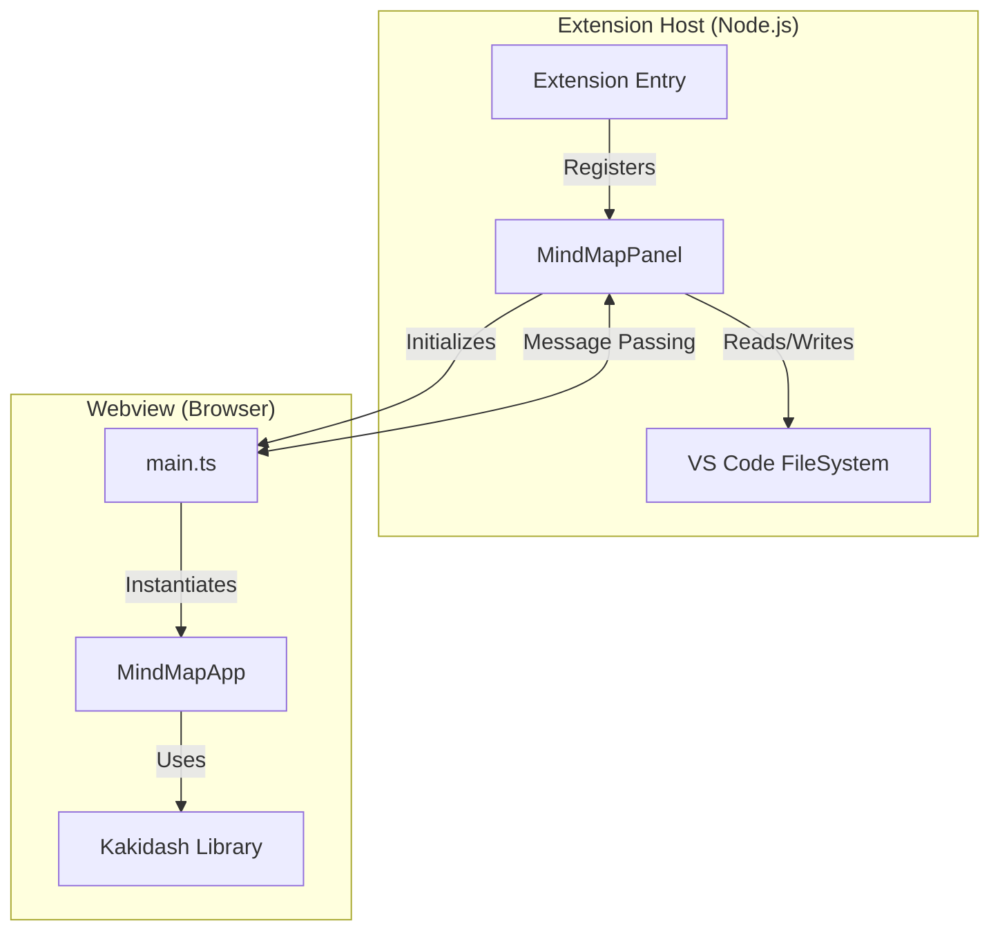
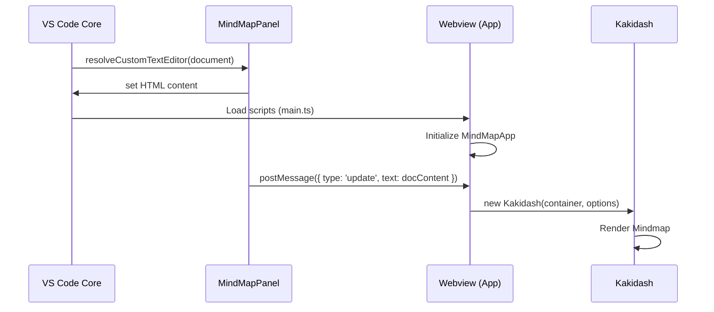
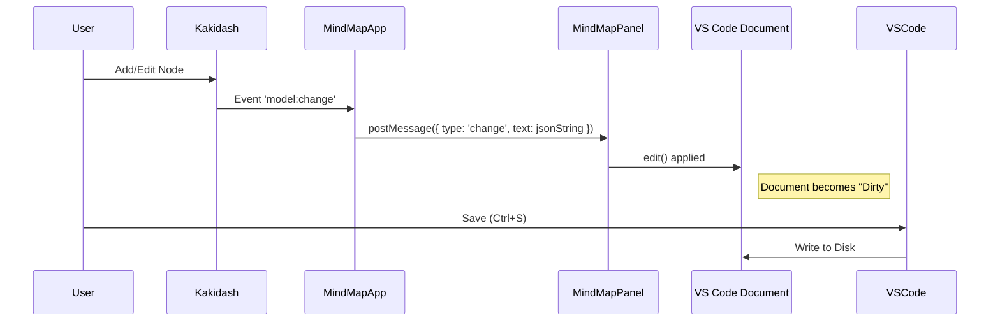

# Kakidash VS Code Extension Architecture

## 1. Architecture Overview

This extension is built as a **Custom Editor** for VS Code, integrating the `kakidash` library to visualize and edit mind maps. The architecture follows a strict separation between the **Extension Host** (Node.js environment) and the **Webview** (Browser environment).

### 1.1 Architecture Diagram



### 1.2 Separation of Concerns

- **Extension Host**: Responsible for lifecycle management, file I/O operations, and interaction with VS Code APIs (commands, configuration). It acts as the "backend" for the custom editor.
- **Webview**: Responsible for rendering the UI and handling user interactions within the editor. It runs the `kakidash` library in a sandboxed browser environment.

## 2. Directory Structure

The source code is organized to reflect the separation between the Extension Host and the Webview.

```
src/
├── extension.ts      # Extension entry point (activates extension)
├── panels/           # Code running in the Extension Host
│   ├── MindMapPanel.ts # Custom Editor logic & Message handling
│   └── getNonce.ts     # Security utility for Content Security Policy
└── webview/          # Code running in the Webview
    ├── main.ts         # Webview entry point
    └── MindMapApp.ts   # Bridge betweeen Webview and Kakidash
```

## 3. Component Details

### 3.1 Extension Host Components

#### `MindMapPanel` (`src/panels/MindMapPanel.ts`)
The core class implementing `vscode.CustomTextEditorProvider`.
- **Responsibilities**:
  - Resolves the Custom Editor.
  - Generates the HTML content for the Webview.
  - Sets up the message channel (`webview.onDidReceiveMessage`).
  - Synchronizes the VSC document model with the Webview state.
- **Key Methods**:
  - `resolveCustomTextEditor`: Called when a user opens a file.
  - `_updateWebview`: Sends document content to the Webview.
  - `_getHtmlForWebview`: Constructs the HTML string with script URIs.

### 3.2 Webview Components

#### `MindMapApp` (`src/webview/MindMapApp.ts`)
The main application logic within the browser context.
- **Responsibilities**:
  - Initializes the `Kakidash` instance.
  - Subscribes to `kakidash` events (e.g., model changes) to notify the Extension Host.
  - Handles messages coming from the Extension Host (e.g., `update` commands).
  - Manages keyboard focus and shortcuts within the Webview.

#### `Kakidash` (Core Library)
The external library responsible for the actual rendering and interaction of the mind map. The extension wraps this library to adapt it to the VS Code environment.

## 4. Key Data Flows

### 4.1 Opening a File



### 4.2 Editing and Saving

This flow ensures that changes in the UI are reflected in the VS Code document model, which then handles the actual file saving.


