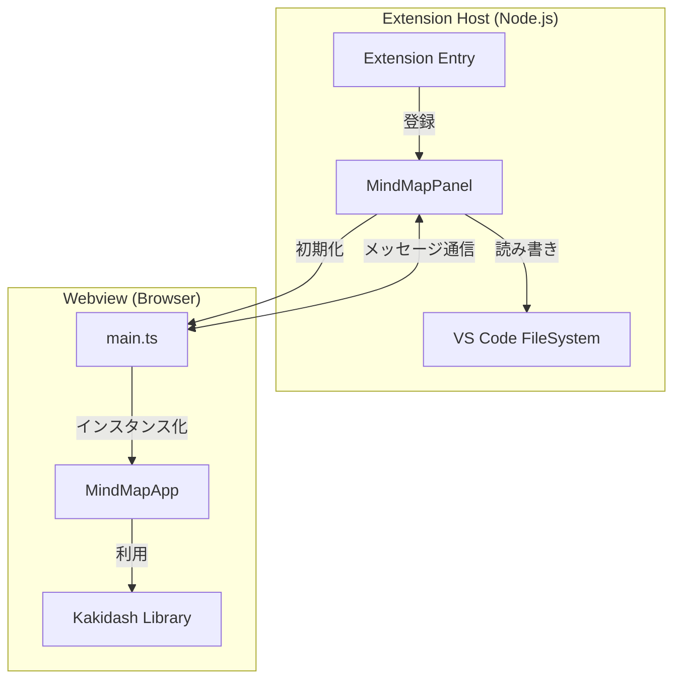
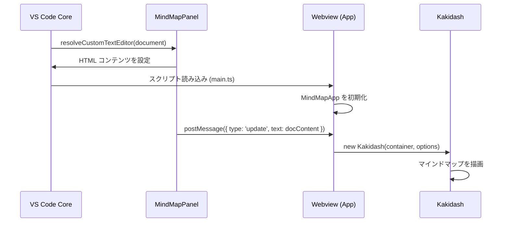
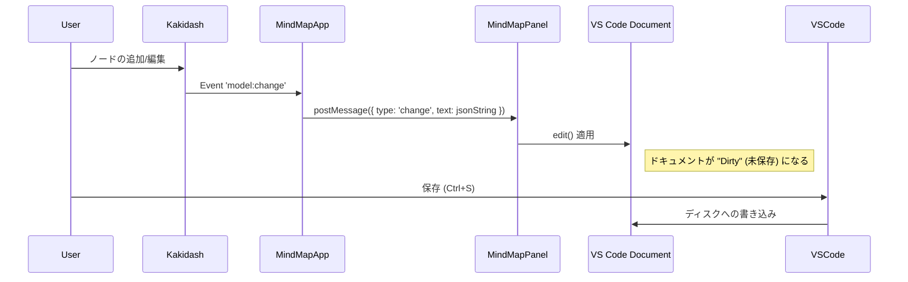

# Kakidash VS Code Extension アーキテクチャ

## 1. アーキテクチャ概要

本拡張機能は、マインドマップを可視化・編集するために `kakidash` ライブラリを統合した VS Code の **カスタムエディタ** です。アーキテクチャは、**Extension Host** (Node.js 環境) と **Webview** (ブラウザ環境) の厳格な分離に基づいています。

### 1.1 アーキテクチャ図



### 1.2 責務の分離

- **Extension Host**: ライフサイクル管理、ファイル I/O 操作、VS Code API (コマンド、設定) との連携を担当します。カスタムエディタの「バックエンド」として機能します。
- **Webview**: UI のレンダリングとエディタ内でのユーザー操作を担当します。サンドボックス化されたブラウザ環境で `kakidash` ライブラリを実行します。

## 2. ディレクトリ構造

ソースコードは、Extension Host と Webview の分離を反映するように構成されています。

```
src/
├── extension.ts      # 拡張機能のエントリーポイント (拡張機能の有効化)
├── panels/           # Extension Host で動作するコード
│   ├── MindMapPanel.ts # カスタムエディタのロジック & メッセージハンドリング
│   └── getNonce.ts     # Content Security Policy 用のセキュリティユーティリティ
└── webview/          # Webview で動作するコード
    ├── main.ts         # Webview のエントリーポイント
    └── MindMapApp.ts   # Webview と Kakidash のブリッジ
```

## 3. コンポーネント詳細

### 3.1 Extension Host コンポーネント

#### `MindMapPanel` (`src/panels/MindMapPanel.ts`)
`vscode.CustomTextEditorProvider` を実装するコアクラスです。
- **責務**:
  - カスタムエディタの解決 (Resolve)。
  - Webview 用の HTML コンテンツの生成。
  - メッセージチャンネル (`webview.onDidReceiveMessage`) のセットアップ。
  - VS Code ドキュメントモデルと Webview 状態の同期。
- **主要メソッド**:
  - `resolveCustomTextEditor`: ユーザーがファイルを開いたときに呼び出されます。
  - `_updateWebview`: ドキュメントの内容を Webview に送信します。
  - `_getHtmlForWebview`: スクリプト URI を含む HTML 文字列を構築します。

### 3.2 Webview コンポーネント

#### `MindMapApp` (`src/webview/MindMapApp.ts`)
ブラウザコンテキスト内の主要なアプリケーションロジックです。
- **責務**:
  - `Kakidash` インスタンスの初期化。
  - `kakidash` イベント (モデルの変更など) の購読と Extension Host への通知。
  - Extension Host からのメッセージ (例: `update` コマンド) の処理。
  - Webview 内でのキーボードフォーカスとショートカットの管理。

#### `Kakidash` (Core Library)
マインドマップの実際のレンダリングとインタインタラクションを担当する外部ライブラリです。本拡張機能はこのライブラリをラップして、VS Code 環境に適応させています。

## 4. 主なデータフロー

### 4.1 ファイルオープン時



### 4.2 編集と保存

このフローにより、UI での変更が VS Code のドキュメントモデルに反映され、実際のファイル保存処理が行われます。


